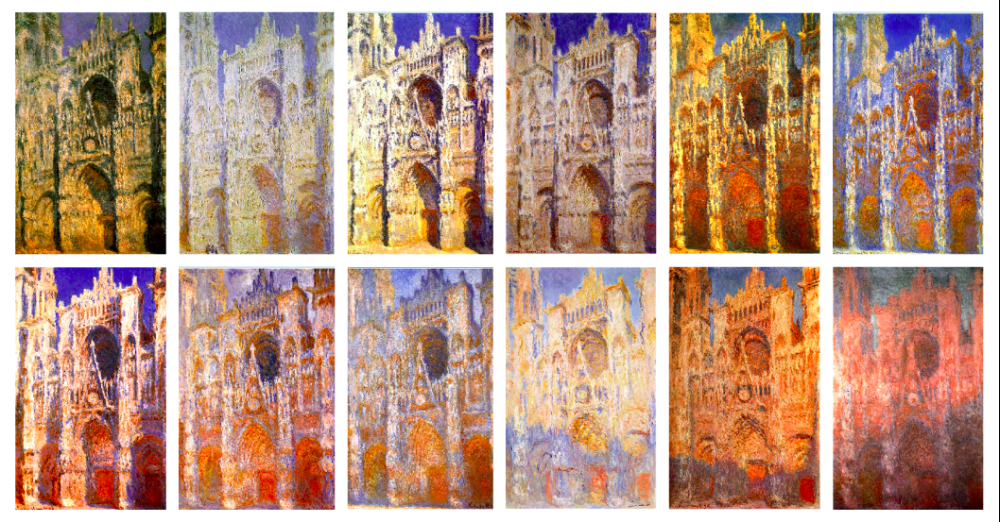
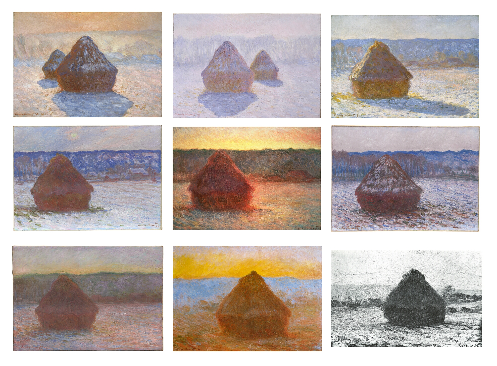

# gang0797_9103_04

# Part 1: Imaging Technique Inspiration

I found inspiration in how **Claude Monet** used to paint the same views and landscapes at different times of the day because he was fascinated by the subtle colour transitions and studies of light.  

We can see this technique represented in Monet’s *Rouen Cathedral* series and also in his *Haystacks* series, for example.  

I’d like to explore **time-based animation** where my artwork’s atmosphere changes gradually, mimicking the passing of time.  
I could animate colours in the artwork to shift slowly, as if day turns to night, for example.  

**Rouen Cathedral Series**

**Haystacks Series**

# Part 2: Coding Technique Exploration

I could use a **time-based parameter** to smoothly change colours or other properties over a cycle.

For example, I could take the passing time in the sketch and turn it into a looping value between 0 and 1, like t = (elapsedMillis % cycleLength) / cycleLength. Then, by using lerpColor() (which blends colours smoothly), I could gradually transition between day and dusk tones. This creates a nice, natural “daylight change” effect that feels fluid and calm instead of sudden. 

In this simple code example (https://editor.p5js.org/BarneyCodes/sketches/GMnG2jvHG), we can see a time-based background transition example.

